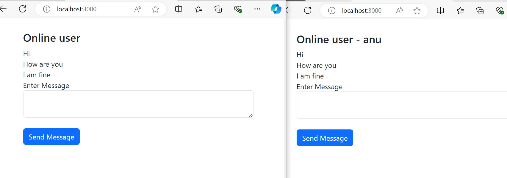

## Chat Application with Node.js and Socket.io

This is a simple chat application built with **Node.js** and **Socket.io**. The application allows users to send and receive real-time messages.

## Features

- Real-time communication using WebSockets
- Display online users
- Send and receive messages
- Lightweight and easy to set up

## Technologies Used

- Node.js
- Express.js
- Socket.io
- HTML/CSS (Bootstrap for basic UI styling)
- jQuery

## Getting Started

### Prerequisites

Before you start, make sure you have Node.js installed. You can download it from [here](https://nodejs.org/).

### Installation

1. Clone the repository:

    ```bash
    git clone https://github.com/<your-username>/chatapp.git
    ```

2. Navigate to the project directory:

    ```bash
    cd chatapp
    ```

3. Install the required dependencies:

    ```bash
    npm install
    ```

### Running the Application

1. Start the server:

    ```bash
    node server.js
    ```

2. Open your browser and go to:

    ```
    http://localhost:3000
    ```

### Project Structure


### Usage

- Open the chat in multiple browser windows to simulate different users.
- Type a message in the input box and press "Send Message".
- Messages will appear in real-time across all connected users.

### Example Screenshots



### Known Issues

- This application is designed for demonstration purposes and doesn't persist messages or users.

## Future Enhancements

- Add user authentication
- Save chat history to a database
- Display active users list

## License

This project is licensed under the MIT License - see the [LICENSE](LICENSE) file for details.


